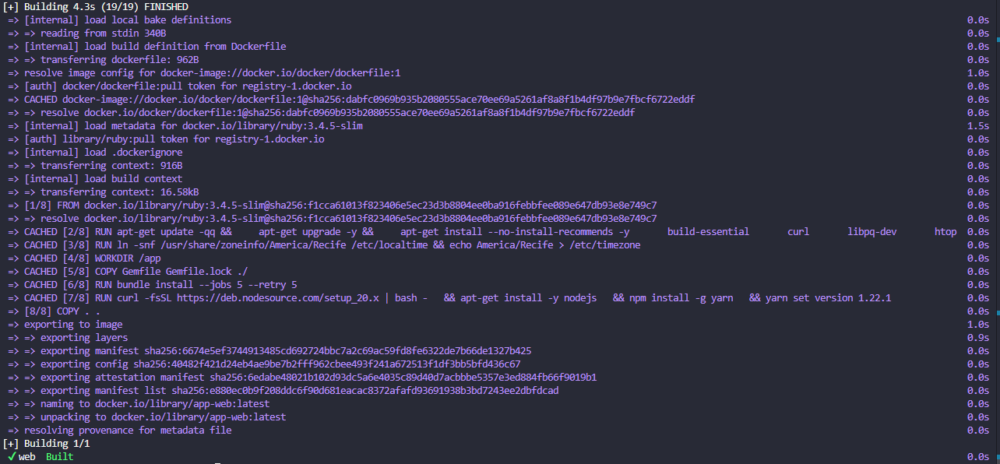
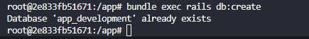

# Configurando Docker para Ruby - 3.4.5 + Rails 8
1. Esta documentação é uma base para nosso projeto: - [Projeto Truck manager](projeto-truck-manager.html)
2. Inicie um novo projeto com Tailwind baseado nesta documentação: - [Ruby + Flowbite + Tailwind](ruby-flowbite-tailwind-css.html)
3. Recursos utilizados:
	- `Ruby 2.3.4`
	- `Rails 8`
	- `Postgresql 15.7`
	- `redis 7`
	- `Sidekiq`
	- `RSpec`
	- `Node.js`
	- `Yarn`
# 1. Adicionando Gems necessárias

1. Adiciona gem do `sidekiq`:
```rb
gem 'sidekiq', '~> 4.1', '>= 4.1.2'
```
2. Adiciona a gem `RSpec`:
```rb
gem 'rspec', '~> 3.4'
```
3. Adiciona a Gem `pg`:
```rb
gem 'pg', '~> 1.5', '>= 1.5.9'
```
4. Adiciona a gem `erb_lint`:
```rb
gem 'erb_lint', '~> 0.5.0'
```
# 2. Configurando Dockerfile

- Vamos aqui configurar o `Dockerfile` na raiz do seu projeto para os container `web`, `db`, `teste` e `redis`:
```dockerfile
# syntax=docker/dockerfile:1

ARG RUBY_VERSION=3.4.5
FROM ruby:$RUBY_VERSION-slim

# Dependências do sistema
RUN apt-get update -qq && \
    apt-get upgrade -y && \
    apt-get install --no-install-recommends -y \
      build-essential \
      curl \
      libpq-dev \
      htop \
      libyaml-dev \
      tzdata && \
    rm -rf /var/lib/apt/lists/*

# Timezone
ENV TZ=America/Recife
RUN ln -snf /usr/share/zoneinfo/$TZ /etc/localtime && echo $TZ > /etc/timezone

# Diretório da aplicação
WORKDIR /app

# Copia e instala gems
COPY Gemfile Gemfile.lock ./
RUN bundle install --jobs 5 --retry 5

# Node.js + Yarn
RUN curl -fsSL https://deb.nodesource.com/setup_20.x | bash - \
    && apt-get install -y nodejs \
    && npm install -g yarn \
    && yarn set version 1.22.1

# Copia o resto da aplicação
COPY . .

# Comando padrão
CMD ["bash", "-c", "bundle exec rails db:prepare && bundle exec rails s -b 0.0.0.0 -p 3000"]
```

# 3. Configurando varáveis de ambiente

- Crie um arquivo chamado `.env_development` e adicione as variáveis:

```bash
REDIS_URL=redis://redis:6379/10
DATABASE_URL=postgres://postgres:postgres@db:5432/app_development
RAILS_ENV=development
```
- Crie o arquivo `.env`, para configurar  as variáveis  de `usario` e senha do `postgres`:
```bash
POSTGRES_USER=postgres
POSTGRES_PASSWORD=postgres
```
# 4. Configurando docker-compose.yml
- Na raiz do seu projeto procure pelo arquivo `docker-compose.yml`, agora vamos crias os containers necessários para subir nosso projeto em desenvolvimento, serão criados os containers `web`, `db` e `test` inicialmente: 

```yml
version: "1.0.0"

services:
  db:
    image: postgres:15.7
    restart: always
    environment:
      POSTGRES_USER: ${POSTGRES_USER} # definido no arquivo.env
      POSTGRES_PASSWORD: ${POSTGRES_PASSWORD} # definido no arquivo.env
      POSTGRES_DB: app_development # banco do development localizado no database.yml
      TERM: xterm-256color
    volumes:
      - postgres_data:/var/lib/postgresql/data
    ports:
      - "5432:5432"

  web:
    build: .
    stdin_open: true
    tty: true
    entrypoint: config/setup_app.sh
    command: bash -c "bin/rails tailwindcss:watch & bundle exec rails s -b 0.0.0.0 -p 3000"
    volumes:
      - .:/app
    ports:
      - "3000:3000"
    depends_on:
      - db
    env_file:
      - ./.env.development

  test:
    build: .
    command: bash -c "RAILS_ENV=test bundle exec rails db:prepare && bundle exec rspec"
    volumes:
      - .:/app
    depends_on:
      - db
    env_file:
      - ./.env.test
  

volumes:
  postgres_data:
```


# 5. Configurando database.yml

Configure:
```yml
default: &default
  adapter: postgresql
  encoding: unicode
  pool: <%= ENV.fetch("RAILS_MAX_THREADS") { 5 } %>
  url: <%= ENV["DATABASE_URL"] %> # Variavél criada no env.development

development:
  <<: *default
  database: app_development # Nome do banco de desenvolvimento usando também no docker-compose.yml
```

# 6. Configurando os arquivos `.sh`
- Crie o  arquivo `setup.sh` dentro do diretório `config` e adicione o código:
```sh
#! /bin/sh

set -e

bundle check || bundle install --jobs 5 --retry 5

if [ -f tmp/pids/server.pid ]; then
  rm tmp/pids/server.pid
fi

if [ "$RAILS_ENV" != "development" ]; then
  echo '--> Running migrations'
  rails db:migrate
  echo '--> end migrations'
  echo '--> Precompiling assets'
  rails assets:precompile
  echo '--> Cleaning assets'
  rails assets:clobber
else
  echo '--> Skiping assets precompilation on development'
fi

exec "$@" # executa o command do container
```
# 7. Fazendo build do Docker

- No termina na raiz do seu projeto rode o comando:
```bash
docker compose build
```
- O Terminal deve retornar algo semelhante a imagem a baixo com a mensagem:
```bash
[+] Building 1/1
 ✔ web  Built   
```


- Agora para subir o servidor na porta 300 rode o comando:
```bash
docker compose up
```
- Deve retornar algo semelhante a imagem com a mensagem de que o servidor esta na porta 3000:
```bash
Listening on http://0.0.0.0:3000
```


- Agora você pode abrir seu navegador na rota informada e deve retornar uma mensagem erro por falta de criação do banco de dados, algo semelhante a imagem:


# 8. Criando migração no db dentro do Docker

- após subir o servidor você pode verificar quais containers estão em execução, em um novo terminal sem fechar o terminal que subiu o `docker` rode  o comando para saber o nome dos containers `on`:
```bash
docker ps
```
- Este comando ovai retornar uma menagem no terminal semelhante a imagem a baixo, e no campo `NAME` vai ter o nome dos containers em execução, algo semelhante a imagem a baixo, se tiver criado o container de `test` ele também deve parecer:


- Agora acesse o container web que em nosso caso se chama `app-web-1`, para acesso digite o comando no terminal:
```bash
docker exec -it app-web-1 bash
```
- Agora ao acessar o terminal do `docker` podemos criar nosso banco e rodar as migrações por lá com os comandos:
- assim criamos o banco de dados:
```bash
bundle exec rails db:create
```
- assim rodamos migrações no banco:
```bash
bundle exec rails db:migrate
```
- Ao cria o banco de dados de retornar algo como:

- agora sim a página root do `Rails 8` deve abrir em seu navegador:


# 9. Finalizando
- Com isso agora conseguirmos trabalhar em nosso projeto desenvolvendo a parte web e rodando as migrações no banco de dados, agora acesse o link para poder adicionar os containers de worker para o redis e sidekiq.