# Documentação do Projeto: Truck Manager

## 1. Visão Geral

O **Truck Manager** é um sistema web, a ser desenvolvido com **Ruby on Rails 8**, projetado para otimizar e controlar o fluxo de caminhões em uma loja de material de construção. O objetivo principal é gerenciar a logística de saída e entrada de veículos, registrando entregas, materiais e rotas, e monitorando o desempenho de caminhões e motoristas de forma eficiente. O sistema será preenchido por uma pessoa responsável para garantir que todos os dados estejam sempre atualizados.

O projeto usará **PostgreSQL** como banco de dados, **Sidekiq** para processamento de tarefas em segundo plano (como envio de e-mails), e o frontend será construído com **Tailwind CSS e Flowbite** para um design moderno e responsivo. A integração com uma API como o **OpenCEP** garantirá o preenchimento automático de endereços.

## 2. Modelos de Dados (Entidades)

O sistema será estruturado com as seguintes tabelas para armazenar as informações, com relacionamentos entre elas:

### **Caminhão**

- **modelo**: Descrição do modelo do caminhão.
    
- **cor**: Cor do veículo.
    
- **capacidade_carga**: A capacidade máxima de carga.
    
- **placa**: Placa de identificação do caminhão (única).
    
- **ano**: Ano de fabricação.
    
- **km_rodado**: Quilometragem atual do veículo, atualizada a cada viagem.
    

### **Motorista**

- **nome**: Nome completo do motorista.
    
- **cpf**: Número de CPF (único).
    
- **cnh**: Número da CNH (única).
    
- **data_nascimento**: Data de nascimento do motorista.
    

### **Endereço do Cliente**

- **logradouro**: Rua ou avenida.
    
- **numero**: Número do local.
    
- **bairro**: Bairro do endereço.
    
- **cidade**: Cidade do endereço.
    
- **estado**: Estado do endereço.
    
- **cep**: Código de Endereçamento Postal.
    

### **Material**

- **nome**: Nome do material (ex: areia, tijolo, cimento).
    
- **capacidade_peso**: Peso unitário ou capacidade do material.
    

### **Evento (Viagem)**

Este será o registro principal da entrega, podendo ter um dos seguintes status: `em_rota`, `pausada`, `retornada`, `cancelada`, `concluída`.

- **horario_saida**: Carimbo de data e hora da saída do caminhão.
    
- **horario_chegada**: Carimbo de data e hora da chegada do caminhão.
    
- **entrega**: Descrição do que foi entregue.
    
- **retorno**: Descrição do que retornou.
    
- **motivo_retorno**: Razão pela qual o material retornou.
    
- **status**: Status atual da viagem.
    
- **caminhao_id**: Chave estrangeira para a tabela `Caminhão`.
    
- **motorista_id**: Chave estrangeira para a tabela `Motorista`.
    
- **rota**: Descrição da rota da entrega.
    
- **cliente_id**: Chave estrangeira para a tabela `Endereço do Cliente`.
    

### **Intercorrência**

- **motivo**: Descrição do problema (ex: acidente, quebra do caminhão).
    
- **evento_id**: Chave estrangeira para a tabela `Evento` (viagem que foi cancelada).
    

## 3. Funcionalidades Principais

- **Gerenciamento de Entidades**: Cadastrar, editar e excluir caminhões, motoristas, endereços de clientes e materiais.
    
- **Fluxo de Eventos**: Gerenciar o ciclo de vida de uma viagem, permitindo as seguintes ações:
    
    - **Registro de Saída**: Inicia a viagem com `status: 'em_rota'`.
        
    - **Pausar Entrega**: Altera o status para `pausada`.
        
    - **Retornar para Estabelecimento**: Altera o status para `retornada` e exige um `motivo_retorno`.
        
    - **Cancelar Entrega**: Altera o status para `cancelada` e exige o registro de uma **Intercorrência**.
        
    - **Registro de Chegada**: Conclui a viagem com `status: 'concluída'`.
        
- **Atualização de Dados**: A quilometragem do caminhão será atualizada após a conclusão de cada viagem.
    
- **Notificações**: O sistema enviará e-mails de notificação sobre o status das entregas.
    
- **Relatórios**: Geração de relatórios em **PDF e Excel** sobre as viagens, entregas e desempenho da frota.
    
- **Integrações e Tecnologias**:
    
    - **API OpenCEP**: Usada para buscar e preencher dados de endereço automaticamente.
        
    - **Sidekiq**: Gerencia o envio de e-mails e a geração de relatórios em segundo plano.
        
    - **RSpec**: Garante a qualidade do código com uma suíte de testes completa.
        
- **Relacionamento Flexível**: Um mesmo caminhão pode transportar múltiplos materiais para um ou mais clientes, respeitando o limite de capacidade.
    

## 4. Fluxograma do Processo

A seguir, um fluxograma que descreve o fluxo de trabalho detalhado para o registro de uma viagem, incluindo as novas funcionalidades de intercorrência e retorno.

```mermaid
flowchart TD
    %% Cores de status
    classDef emRota fill:#facc15,stroke:#333,color:#000;
    classDef concluida fill:#4ade80,stroke:#333,color:#000;
    classDef retornando fill:#60a5fa,stroke:#333,color:#000;
    classDef cancelada fill:#f87171,stroke:#333,color:#000;
    classDef alerta fill:#fbbf24,stroke:#333,color:#000;
    classDef cadastro fill:#a78bfa,stroke:#333,color:#000;

    %% Início do sistema
    A["🚀 Início: Acessar Truck Manager"] --> B{"📝 Deseja Cadastrar Dados ou Registrar Saída?"}

    %% Cadastro de entidades detalhado
    B -->|Cadastrar Dados| C1["🚚 Cadastro de Caminhões"]
    %% Caminhão
    C1 --> C1a["Modelo, Cor, Capacidade, Placa, Ano, KM"]
    C1a --> C2["👨‍✈️ Cadastro de Motoristas"]
    %% Motorista
    C2 --> C2a["Nome, CPF, CNH, Data de Nascimento"]
    C2a --> C3["🏠 Cadastro de Clientes / Endereços"]
    %% Cliente
    C3 --> C3a["Logradouro, Número, Bairro, Cidade, Estado, CEP"]
    C3a --> C4["📦 Cadastro de Materiais"]
    %% Material
    C4 --> C4a["Nome, Capacidade/Peso"]
    C4a --> B

    %% Registrar saída
    B -->|Registrar Saída| D["🚚 Selecionar Caminhão Disponível"]
    D --> E["👨‍✈️ Selecionar Motorista"]
    E --> F["📦 Selecionar Materiais e Quantidades"]
    F --> G{"⚖️ Capacidade do Caminhão Suficiente?"}
    G -->|Sim| H["🕒 Registrar Horário de Saída e Rota"]
    H --> I["📤 Atualizar Status: Em Rota"]
    I --> J["✉️ Enviar E-mail de Notificação aos Clientes"]
    I --> K["📊 Atualizar Dashboard: Status de Todos os Caminhões"]

    %% Ocorrências em rota
    J --> L{"⚠️ Ocorrência na Rota?"}
    L -->|Problema Grave| M["💥 Registrar Intercorrência"]
    M --> N["❌ Cancelar Viagem"]
    N --> O["Status: Cancelada"]
    O --> P["📧 Enviar E-mail de Cancelamento para Clientes"]
    P --> Q["🏁 Fim: Viagem Cancelada"]

    L -->|Problema Leve| R["↩️ Registrar Retorno ao Estabelecimento"]
    R --> S["Status: Retornada"]
    S --> T{"🔄 Deseja Recarregar ou Cancelar?"}
    T -->|Recarregar| U["📦 Adicionar Mais Materiais"]
    U --> F
    T -->|Cancelar| V["💥 Registrar Intercorrência"]
    V --> O

    %% Chegada no destino
    L -->|Sem Ocorrência| W{"🏁 Chegou ao Destino?"}
    W -->|Sim| X["📦 Registrar Entrega ao Cliente"]
    X --> Y["🔄 Atualizar Quantidade Entregue e Capacidade do Caminhão"]
    Y --> Z["🕒 Registrar Horário de Chegada"]
    Z --> AA["✅ Status: Concluída"]
    AA --> AB["📊 Atualizar KM do Caminhão"]
    AB --> AC["🏁 Fim: Viagem Concluída"]

    W -->|Não| AD["⏸️ Continuar Viagem ou Pausar"]
    AD --> I

    %% Se não registrar saída
    B -->|Não Registrar Saída| AE["🏁 Fim"]

    %% Dashboard Views
    subgraph Dashboard
        K
        AA
        O
        S
    end

    %% Classes
    class I emRota;
    class AA concluida;
    class S retornando;
    class O cancelada;
    class L alerta;
    class C1,C1a,C2,C2a,C3,C3a,C4,C4a cadastro;

```

